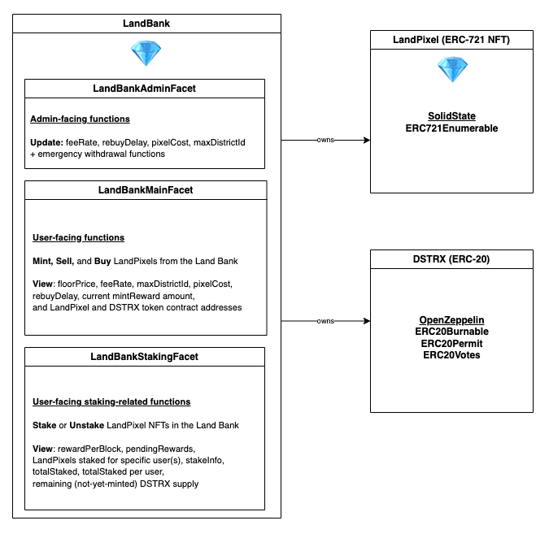

# Districts Smart Contracts

Solidity smart contracts for the Realio Districts project plus their documentation, tests, and deployment artifacts.

## Getting Started

To get started, first install dependencies:

```bash
npm install
```

To spin up a local node with Hardhat:

```bash
npx hardhat node
```

With a local Hardhat node running, a separate terminal can run the Ignition deployment script to deploy the Districts contracts (including the LandBank Diamond contract and its facets, the DSTRXToken ERC20 contract, and the LandPixel Diamond ERC721 contract and its facets) locally:

```bash
npx hardhat run scripts/deploy.ts
```

Linting and formatting: `npm run lint` and `npm run format`

## Testing

To run the included Hardhat tests, run:

```bash
npx hardhat test
```

To run the included Forge tests, [install Foundry](https://getfoundry.sh/) and run:

```bash
forge test
```

## Architecture



Districts is comprised of the following Solidity contracts:

### DSTRXToken

[DSTRXToken](contracts/DSTRXToken.sol) is a standard [ERC20](https://docs.openzeppelin.com/contracts/4.x/api/token/erc20) token which is [Ownable](https://docs.openzeppelin.com/contracts/5.x/api/access#Ownable) and [Burnable](https://docs.openzeppelin.com/contracts/5.x/api/token/erc20#ERC20Burnable) (to allow LandBank minting and burning) extended with [ERC20Votes](https://docs.openzeppelin.com/contracts/4.x/api/token/erc20#ERC20Votes) (for voting/governance compatibility).

Note: the DSTRXToken is _not_ a Diamond facet, and is instead a standalone, standard ERC20 token contract. This saves on gas cost overhead (avoiding proxy delegatecalls where possible) and increases compatibility with standard tools and services like Etherscan and other block/token explorers.

### LandPixel (NFT)

The [LandPixel](contracts/facets/LandPixelFacet.sol) NFT contract is an [Enumerable](https://docs.openzeppelin.com/contracts/4.x/api/token/erc721#ERC721Enumerable) [ERC721](https://docs.openzeppelin.com/contracts/4.x/erc721) [ERC-2535 Diamond](https://eips.ethereum.org/EIPS/eip-2535) contract on which the LandBank is the sole authorized minter. Each LandPixel is distinguished by a positive number/index (based off the order in which Districts regions [[H3 hexagons](https://h3geo.org/)] are made available), with `tokenURI` pointing to the full NFT metadata. The `tokenURI` should always point to resources adhering to [OpenSea Metadata Standards](https://docs.opensea.io/docs/metadata-standards) and is currently [fixed](#landpixel-status).

### LandBank Diamond

The LandBank is an [ERC-2535 Diamond](https://eips.ethereum.org/EIPS/eip-2535) contract with [ReentrancyGuard protections](https://docs.openzeppelin.com/contracts/4.x/api/security#ReentrancyGuard) which owns (and thus can mint) the DSTRXToken and LandPixel contracts. [LandBankMainFacet](./contracts/facets/LandBankMainFacet.sol) contains most user-facing functions for interacting with the LandBank, [LandBankAdminFacet](./contracts/facets/LandBankAdminFacet.sol) contains the admin-facing functions for managing the LandBank settings, and [LandBankStakingFacet](./contracts/facets/LandBankStakingFacet.sol) contains user-facing staking-related code and methods. As recommended, the [Diamond-1-Hardhat Implementation](https://github.com/mudgen/diamond-1-hardhat) was used for setting up the Diamond scaffolding. Additional Diamond tooling (e.g. OwnableInternal and AccessControl code) is provided by the [SolidState library](https://github.com/solidstate-network/solidstate-solidity).

The LandBank facilitates:

- `mintLandPixels`: LandPixel (and DSTRXToken) minting, restricted according to available regions (internally represented as `uint256` id values; we will use a custom off-chain indexing scheme to map these ids to [H3 hexagons](https://h3geo.org/))
- `sellLandPixel`: standing bid function based upon total treasury holdings at the time (establishes a floor price for LandPixels); this works only after `rebuyDelay` seconds have elapsed since the LandPixel was minted
- `buyLandPixels`: identical to `mintLandPixels` except no new DSTRX tokens get minted and the LandPixel(s) must be owned by the LandBank
- `stakeLandPixel`: staking a LandPixel into the LandBank for it to begin earning DSTRX staking rewards; rewards are based off remaining not-yet-minted DSTRX supply (beginning at 1 DSTRX per block and gradually dropping from there), and distributed equally among all actively staked LandPixels
- `unstakeLandPixel`: withdraw a staked LandPixel and claim the owed DSTRX rewards for the total staking lockup duration

The treasury holdings can be funded both internally (by the LandBank itself) and externally (from any Districts Marketplace contracts or other sources) by any service fees or commissions collected during operation.

#### Upgrading the LandBank Diamond

An example upgrade script is included [here](/scripts/upgrade.ts). In this example, it is assumed that the LandBankMainFacet logic has been updated, but that no storage changes were made; after updating `diamondAddress` to the contract address of the Diamond being upgraded in the script, a normal `npx hardhat run scripts/upgrade.ts` would upgrade the LandBankMainFacet of the Diamond to the new version.

### Marketplace

The LandPixelMarketplace contract supports listing and trading LandPixel NFTs, set up to automatically fund the LandBank treasury from collected fees. The LandBank logic is agnostic with respect to Marketplace details; in fact, multiple Marketplace contracts or instances can be deployed, each one set up to fund the LandBank vault/treasury with the fees it collects.

The [included Marketplace contract](./contracts/Marketplace.sol) supports:

- `listForSale`: allows a seller to list a LandPixel NFT for sale; seller can specify:
  - `tokenId`: which LandPixel NFT ID is being sold (**note: the Marketplace contract must be `approve`d for the LandPixel ID in question,** otherwise it will be unable to transfer ownership to itself during listing and the call will revert)
  - `startingPrice`: minimum bid amount
  - `saleType`: whether the sale is a FixedPrice or Auction type sale (`0` or `1`, respectively)
  - `duration`: how long the auction/sale will be active, in seconds
  - `buyNowPrice`: if `0` there is no "Buy Now" support on this auction, if it is any value above `0` then the LandPixel can be bought immediately at the price specified
  - `paymentToken`: address of the payment token accepted for this auction (either the ERC20 contract address for ERC20-based sales, or `0x000000000000000000000000000000000000000` if the payment token should be the native token [e.g. ETH on Ethereum, or RIO on Realio Network])
- `unlist`: allows a seller to unlist/deactivate a current listing
- `bid`: allows a bidder/buyer to bid on an existing listing (if the payment token is `0x000000000000000000000000000000000000` then the bidAmount must be equal to the `msg.value`, otherwise the Marketplace contract must be `approve`d for the `bidAmount` on the paymentToken ERC20 contract)
- `makeOffer`: allows a prospective buyer to make an offer on a LandPixel NFT even if there's no active listing of it in the Marketplace, which the owner can accept; the `duration` (in seconds) allows the offer to expire after a set amount of time
- `acceptOffer`: allows the LandPixel owner to accept an offer that a buyer made with a `makeOffer` function call
- `buyNow`: allows a buyer to buy a listed LandPixel NFT that has a nonzero `buyItNow` price
- `finalizeAuction`: callable after an auction has been completed, to make the appropriate transfers and collect the appropriate fees
- `withdrawEscrow`: allows bidders to withdraw any escrowed value (for native token [e.g. ETH on Ethereum] use address `0x0000000000000000000000000000000000000000`, for ERC20 tokens, use the token contract address) from the contract which is not involved in any current active bids
- `withdrawOffer`: allows a bidder to withdraw their offer amount after the offer has expired

### Governance

Governance contracts are the mechanisms by which Districts users can participate in project development. It will be split into two phases:

1. Initially, we will support voting on which Districts regions will next become available, via the [UnlockDistrictVote contract](./contracts/UnlockDistrictVote.sol).
2. Later, in the Build phase and beyond, we intend to support more meaningful distributed governance. This may include enabling community voting on LandBank properties (e.g. the `feeRate` percentage or the `rebuyDelay` waiting period), new features and proposals, or even treasury management and other economic decisions. This may involve vote-escrowed tokens (a la Curve), ERC20 voting (a la Compound), and/or even an on-chain DAO, but the details are yet to be finalized. While advanced governance contracts have not yet been included in this repository, the logic and operation of the LandBank allows these to be rolled out and easily integrated at any time.

Votes and community signaling can be done securely with standard [Governor contracts](https://docs.openzeppelin.com/contracts/5.x/governance) and/or Curve-like vote-escrow voting systems. The DSTRXToken uses the [ERC20Votes](https://docs.openzeppelin.com/contracts/4.x/api/token/erc20#ERC20Votes) extension so that it is compatible out-of-the-box with any Governor contracts and things like [Tally](https://www.tally.xyz/). LandPixels themselves are not extended with [ERC721Votes](https://docs.openzeppelin.com/contracts/5.x/api/token/erc721#ERC721Votes) for direct NFT vote support.

### LandBank Status & Scope

The LandBank contract:

- only recognizes native-token deposits; [support for other ERC20 token(s) demonstration implementation here](https://github.com/realiotech/districts-smart-contracts/tree/feat/justin/erc20-token-support); for floorPrice calculations and price consistency, the LandBank contract should accept only a single type of payment token
- offers DSTRX rewards for staked LandPixel deposits via the LandBankStakingFacet; the reward schedule is 1/100M of the remaining unminted DSTRX supply (from the 100M user-allocated supply) per block, distributed among all staked LandPixels equally
- supports batched minting and buying with unbounded list sizes
- manages funds directly, i.e. itself serves as treasury/vault contract
- uses [ReentrancyGuard](https://docs.openzeppelin.com/contracts/4.x/api/security#ReentrancyGuard) rather than a [PullPayment](https://docs.openzeppelin.com/contracts/4.x/api/security#PullPayment) model (for UX simplicity)
- restricts District region availability via enforcing a ceiling on LandPixel `tokenId`s (but no floor)
- uses AccessControl for fine-tuned role restrictions (for admin control via the LandBankAdminFacet)
- uses `landPixel.transferFrom` rather than `landPixel.safeTransferFrom` + `IERC721Receiver` because all transfers are initiated by the LandBank contract itself, avoiding any need for the extra call to onERC721Received and thus resulting in lower gas costs
- only enforces the `rebuyDelay` seconds cooldown after mintings (not after `buyLandPixels` calls)
- requires approval (in a separate `approve` transaction) for LandPixel tokens for `sellLandPixel` and `stakeLandPixel` flows (it is possible to override `isApprovedForAll` to bypass approval requirements for the LandBank, but this complicates trust and security assumptions and would be nonstandard)

### LandPixel Status

The LandPixel NFT contract facet defaults to a `tokenURI` of `https://districts.xyz/landpixel/<tokenId>` and supports [admin (owner) updates to this value](contracts/facets/LandPixelFacet.sol#L51) on a global basis, but targeted batch updates of it (especially if to IPFS documents, which are hash-based) may be non-trivial to support, Diamond upgradeability notwithstanding.

## Troubleshooting Tips

If you encounter an error like `HardhatPluginError: The deployment wasn't run because of the following reconciliation errors: * LaunchLandBank#LandBank: Artifact bytecodes have been changed` during a re-deploy attempt after any contract updates, you can [wipe](https://hardhat.org/ignition/docs/guides/error-handling#wiping-a-previous-execution) the older local deployment with:

```bash
npx hardhat ignition wipe chain-31337 LaunchLandBank#LandBank
```

After wiping the local deployment artifacts with the above command, deployments should work again.
